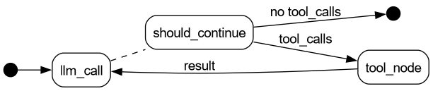
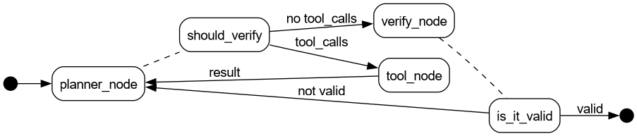

#+TITLE: 读：LLM Agent 入门——经典 Agent 分类与 LangChain/LangGraph 实践
#+AUTHOR: lujun9972, Claude Code
#+TAGS: AI, Agent, LLM, LangChain, LangGraph, 入门
#+DATE: [2026-05-30 Sat]
#+LANGUAGE: zh-CN
#+OPTIONS: H:6 num:nil toc:t \n:nil ::t |:t ^:nil -:nil f:t *:t <:nil
#+DESCRIPTION: 解读 DZone 上 Harshita Asnani 和 Takshil Mehta 的 LLM Agent 入门教程。从 Russell & Norvig 的经典 Agent 定义出发，梳理 Agent 五分类（Simple Reflex → Learning），在 LLM 语境下重新理解这些概念。然后用 LangChain 和 LangGraph 实现一个「Chef Agent」从简单到复杂的三个版本，代码通过 DeepSeek API 实际验证。

* 导读

说真的，一篇引路的文章比一百篇学完就忘的文章有价值多了。DZone 上 Harshita Asnani 和 Takshil Mehta 的这篇 [[https://dzone.com/articles/llm-agents-and-getting-started-with-them][LLM Agents and Getting Started with Them]] 就是这种引路文章。它没有搞高深的理论推演，就是从 / 人工智能/ 教科书里的经典 Agent 定义出发，一路搭到 LangChain 和 LangGraph 的具体实现。读完之后你大概能回答三个问题。Agent 到底指什么，LLM Agent 的复杂度怎么分档，从简单到复杂的实现用什么工具。

如果你看过我之前那篇「读：从API调用到Agent循环——构建Agent的七个阶段」，那篇讲的是"怎么做"，从 API 调用手把手构建 Agent 的工程细节。这篇讲的是"什么是什么"，从经典分类建立认知框架，告诉你不同场景该用多复杂的方案。两篇恰好互补，就像知道怎么造锤子不等于知道哪把锤子打什么钉子。

原文的代码用的 Groq API，我改成了 DeepSeek 的 OpenAI 兼容接口（api.deepseek.com/v1），Agent 架构逻辑完全没动。

* 什么是 Agent？

如果你在搜索引擎里搜「AI Agent」，能看到一大堆互相矛盾的说法。有人管任何带工具调用的聊天机器人叫 Agent，有人觉得能自主决策才算。原文为了避免概念混乱，直接拎出了这个领域最被公认的定义，来自 Stuart Russell 和 Peter Norvig 的教科书 /人工智能：一种现代方法/ 。

> Agent 是通过传感器感知环境、通过执行器作用于环境的任何东西。

这个定义虽然宽泛，但抓住了本质，就是 *感知 → 决策 → 行动* 这个循环。拿扫地机器人来说。

#+begin_src text
1. PERCEIVE  → 传感器检测到前方地面有灰尘
2. DECIDE    → 决定向前移动并启动清扫
3. ACT       → 轮子前进、刷子旋转、吸尘电机工作
4. REPEAT    → 继续直到地面干净
#+end_src

LLM Agent 把物理传感器换成了文本输入和 API 响应，「执行器」变成了生成文本和调用函数。循环逻辑说到底是一样的。

* Agent 的五种类型

Russell & Norvig 的《人工智能：一种现代方法》（Artificial Intelligence: A Modern Approach）把 Agent 按智能水平分为五类。下面这张表帮你快速看清楚。

| 类型 | 核心机制 | 一句话类比 | LLM 场景 |
|------+----------+------------+----------|
| Simple Reflex Agent | 条件-行动规则，只看当前输入 | 自动售货机：投币就出货 | 无上下文的单轮问答 |
| Model Based Reflex Agent | 内部状态 + 环境模型 | 有记忆的自动售货机：记得你上次买了什么 | 带对话历史的聊天机器人 |
| Goal Based Agent | 目标状态 + 反向规划 | 导航仪：给定目的地，自己规划路线 | 自主任务分解（帮我订火车票） |
| Utility Based Agent | 目标 + 效用函数（优化指标） | 导航仪选最快而非最近的路 | 约束满足（预算内最优方案） |
| Learning Agent | 执行 + 反馈 + 自我改进 | 老司机：开得越多技术越好 | 从用户反馈中持续调优 |

*Simple Reflex Agent* 只看当前输入，按「如果 X 就做 Y」的规则响应，不考虑历史也不考虑未来。最简单的聊天机器人就属于这一类，你问什么它答什么，没有上下文。

*Model Based Reflex Agent* 在反射的基础上加了内部状态（模型），能追踪环境变化。相当于聊天机器人加了对话记忆，知道前面聊过什么。

*Goal Based Agent* 不光知道当前状态还知道目标状态，能反向规划达成目标的步骤。你告诉它「帮我订一张去北京的火车票」，它就能自己拆成查车次、比价格、下单、支付这些步骤。

*Utility Based Agent* 在目标基础上加入优化指标，不仅要达成目标，还要以最优方式达成。同样是找路，它不只找到路还找最短的那条。

*Learning Agent* 根据执行结果自我改进，有学习模块、执行模块和问题生成器，能从失败中学习。

说实话，这五个分类的价值不在那五个名词上面。 这套分类的真正价值是给你一张路线图，让你能根据问题复杂度选择合适的方案。需求只是一个聊天机器人，就不要去搭 Planner-Verifier 循环；需求涉及目标规划和约束满足，就别在 Simple Reflex 上硬撑。有了这个框架，你就能说清楚「我的系统现在在哪一层、下一步要加什么」。

* LLM Agent 的四组件

一个 LLM Agent 通常有四个组件：

*核心大脑（LLM）* 负责理解指令和生成回复，是 Agent 的决策中心。

*规划模块* 把大任务拆成子任务，定执行顺序。简单场景不需要它，复杂场景靠它分解步骤。

*记忆* 分短期和长期。短期就是当前对话上下文，长期靠向量数据库或文件持久化。

*工具* 是 Agent 能调用的外部功能，如搜索引擎、计算器、API、数据库查询。

> *小贴士* ，还有很多初学者以为 LLM「调用」工具是 LLM 亲自去执行代码。其实不是，LLM 只负责输出一个结构化的工具调用请求，框架层截获这个请求，执行对应的函数，把结果送回给 LLM。整个过程 LLM 只管「说」，不管「做」。你看 LLM 实际返回的数据结构就清楚了。

#+begin_example
  {
    "tool_calls": [
      {
        "id": "call_00_DO5jlPRbk6yVtWX2tjx87594",
        "type": "function",
        "function": {
          "name": "get_inventory",
          "arguments": "{}"
        }
      }
    ]
  }

#+end_example

「说」靠的是训练数据中学到的格式能力（输出合法 JSON），「做」靠的是框架的 Tool Calling 机制（解析 JSON → 执行函数 → 返回结果）。后面 Stage 2 的 =bind_tools= 就是在告诉 LLM，你可以说这些话（工具名称和参数 schema），我们会帮你做。

在这四个组件中，LLM 是「脑子」，工具是「手」，记忆是「工作台」，规划模块是「操作流程」。缺任何一个，Agent 都不完整。

* LangChain vs LangGraph，什么时候用哪个

LangChain 和 LangGraph 都是同一个团队（LangChain 公司）开发的 LLM 应用框架，定位不同。LangChain 是最早发布的，主打「链」（Chain）的概念，把提示词、模型调用、输出解析串成一条线性流水线，一个输入进去，经过一串步骤，出来一个输出。LangGraph 是后来出的，主打「图」（Graph）的概念，用节点（Node）和边（Edge）定义执行流程，支持循环、条件分支、回溯。简单说，LangChain 是单向管道，LangGraph 是带环路的流程图。

原文把两个框架的选型和 Agent 复杂度绑在一起。大致的逻辑是这样的。

- *LangChain* 适合线性流程（DAG，有向无环图）。每个步骤按顺序执行，没有循环，没有分支回溯。对应 Simple Reflex Agent 的场景，输入直接映射到输出。
- *LangGraph* 适合有循环、条件分支、回溯的复杂流程。适合 Model Based、Goal Based 等高级 Agent，因为 Agent 需要「思考→行动→观察→再思考」的循环。

其实这个选型原则说的就是框架的复杂度应该匹配问题本身的复杂度。一个简单的输入→输出映射用不着搞个图。

* 实践，Chef Agent 三阶段

原文用一个统一的例子，「Chef Agent」，贯穿三阶段，逐步增加复杂性。

** 环境准备

先装依赖。

#+begin_src shell
pip install langchain langchain-openai langgraph langchain-core pydantic python-dotenv
#+end_src

配置 DeepSeek API key。

#+begin_src python
import os
from dotenv import load_dotenv
load_dotenv()

DEEPSEEK_API_KEY = os.environ.get("DEEPSEEK_API_KEY")
model = "deepseek-chat"
#+end_src

初始化 LLM。

#+begin_src python
from langchain_openai import ChatOpenAI

llm = ChatOpenAI(
    model=model,
    openai_api_key=DEEPSEEK_API_KEY,
    openai_api_base="https://api.deepseek.com/v1",
    temperature=0,
)
#+end_src

以后的代码每次用到 =llm= 都用这个配置。

** Stage 1: Simple Reflex Agent（LangChain）

最简单的 Agent，问什么直接答什么。用 LangChain 的链（Chain）就能搞定。

#+begin_src python :tangle chef_agent_stage1.py
from langchain_core.prompts import ChatPromptTemplate
from langchain_core.output_parsers import StrOutputParser

reflex_prompt = ChatPromptTemplate.from_template(
    "You are a chef. Given a request: {input}, provide a single recipe immediately."
)
reflex_agent = reflex_prompt | llm | StrOutputParser()

print(reflex_agent.invoke({"input": "我想吃辣的"}))
#+end_src

执行结果如下。

#+begin_src text
*麻辣香锅*

**食材：**
- 虾 200g
- 午餐肉 100g
- 土豆 1个
- 藕片 100g
- 西兰花 100g
- 干辣椒 20个
- 花椒 2汤匙
- 豆瓣酱 1汤匙
- 火锅底料 1小块
- 蒜 5瓣
- 姜 3片
- 生抽 1汤匙
- 糖 1茶匙

**做法：**
1. 虾去虾线，午餐肉切片，土豆切条，藕切片，西兰花掰小朵
2. 所有蔬菜焯水至八成熟，捞出沥干
3. 热锅冷油，小火炒香干辣椒、花椒、蒜、姜
4. 加入豆瓣酱和火锅底料，炒出红油
5. 先炒虾和午餐肉至变色，再加入所有蔬菜翻炒均匀
6. 加生抽、糖调味，大火快炒1分钟即可

**辣度：🔥🔥🔥🔥🔥** 麻辣鲜香，超级下饭！
#+end_src

输出符合预期，输入「我想吃辣的」就返回一份麻辣香锅食谱。没查库存也没问偏好，就是最简单的「问→答」。

但问题也很明显，它不知道你有什么食材。你冰箱里只有土豆和胡萝卜，它还是给你推麻辣香锅，虾和午餐肉都没有，怎么做？实用性为零。

** Stage 2: Model-Based Reflex Agent（LangGraph）

第二阶段的 Agent 不只盯着用户输入，还看「内部状态」，就是你的库存和饮食偏好。用 LangGraph 是因为这玩意需要循环，LLM 先决定要不要查库存或偏好，查完之后重新生成回答。

完整实现是这样的。

#+begin_src python :tangle chef_agent_stage2.py
import operator
from typing import Annotated, List, Literal
from langchain.tools import tool
from langgraph.prebuilt import ToolNode, InjectedState
from langchain.messages import AnyMessage, SystemMessage
from typing_extensions import TypedDict

# ---------- 1. 定义工具 ----------
@tool
def get_inventory(state: Annotated[dict, InjectedState]):
    """Get current user inventory"""
    return state["inventory"]

@tool
def get_dietary_prefs(state: Annotated[dict, InjectedState]):
    """Get user dietary preferences"""
    return state["dietary_prefs"]

tools = [get_inventory, get_dietary_prefs]
model_with_tools = llm.bind_tools(tools)

# ---------- 2. 定义状态 ----------
class RecipeState(TypedDict):
    inventory: List[str]
    dietary_prefs: List[str]
    messages: Annotated[List[AnyMessage], operator.add]

# ---------- 3. LLM 节点 ----------
def llm_call(state: dict):
    messages_to_send = [
        SystemMessage(
            content="You are a helpful chef agent. When user asks for a recipe, "
                    "look at user's current inventory and dietary preferences to "
                    "suggest the recipe. You can use the available tools whenever needed."
        )
    ] + state["messages"]
    response = model_with_tools.invoke(messages_to_send)
    return {"messages": [response]}

# ---------- 4. 工具节点 ----------
tool_node = ToolNode(tools)

# ---------- 5. 条件边 ----------
def should_continue(state: RecipeState) -> Literal["tool_node", "__end__"]:
    messages = state["messages"]
    last_message = messages[-1]
    if last_message.tool_calls:
        return "tool_node"
    return "__end__"

# ---------- 6. 构建图 ----------
from langgraph.graph import StateGraph, START, END

agent_builder = StateGraph(RecipeState)
agent_builder.add_node("llm_call", llm_call)
agent_builder.add_node("tool_node", tool_node)
agent_builder.add_edge(START, "llm_call")
agent_builder.add_conditional_edges("llm_call", should_continue, ["tool_node", END])
agent_builder.add_edge("tool_node", "llm_call")
agent = agent_builder.compile()

# ---------- 7. 执行 ----------
from langchain.messages import HumanMessage

messages = [HumanMessage(content="推荐一个菜")]
current_inventory = ["豆腐", "牛肉末", "豆瓣酱", "葱", "花椒", "米饭"]
current_dietary_prefs = []

result = agent.invoke({
    "inventory": current_inventory,
    "dietary_prefs": current_dietary_prefs,
    "messages": messages,
})
for m in result["messages"]:
    m.pretty_print()
#+end_src

这个图对应 LangGraph 的执行流程：

#+begin_src dot :file images/chef_agent_stage2.png :results silent
digraph G {
    rankdir=LR;
    node [shape=box, style=rounded, fontname="Helvetica"];
    edge [fontname="Helvetica"];

    START [shape=point, width=0.2];
    END [shape=point, width=0.2];

    START -> llm_call;
    llm_call -> should_continue [style=dashed, arrowhead=none];
    should_continue -> tool_node [label="tool_calls"];
    should_continue -> END [label="no tool_calls"];
    tool_node -> llm_call [label="result"];
}
#+end_src

执行结果（ =m.pretty_print()= 输出）：

#+begin_src text
================================ Human Message =================================

推荐一个菜
================================== Ai Message ==================================

好的，让我先看看你的食材库存和饮食偏好！
Tool Calls:
  get_inventory (call_00_DO5jlPRbk6yVtWX2tjx87594)
 Call ID: call_00_DO5jlPRbk6yVtWX2tjx87594
  Args:
  get_dietary_prefs (call_01_Lf5BpsNklP5TWDekVOrj5175)
 Call ID: call_01_Lf5BpsNklP5TWDekVOrj5175
  Args:
================================= Tool Message =================================
Name: get_inventory

["豆腐", "牛肉末", "豆瓣酱", "葱", "花椒", "米饭"]
================================= Tool Message =================================
Name: get_dietary_prefs

[]
================================== Ai Message =================================

看起来你的饮食偏好没有特别设置，而你的库存里有以下食材：

- 🥩 **牛肉末**
- 🧈 **豆腐**
- 🌶️ **豆瓣酱**
- 🌿 **葱**
- 🌰 **花椒**
- 🍚 **米饭**

我强烈推荐你做一道经典川菜——**麻婆豆腐**！这些食材正好齐全，而且非常下饭！😋

---

## 🍽️ 麻婆豆腐 食谱

### 食材（用你现有的）
| 食材 | 用量 |
|------|------|
| 豆腐 | 1块（切小方块） |
| 牛肉末 | 100g |
| 豆瓣酱 | 1-2大勺 |
| 花椒 | 1小勺（碾碎） |
| 葱 | 2根（切葱花） |
| 米饭 | 搭配食用 |

### 做法步骤
1. **处理豆腐**：豆腐切小方块，烧一锅水加少许盐，将豆腐焯水1-2分钟，捞出沥干备用。
2. **炒肉末**：锅中倒油，放入牛肉末炒至变色、出香。
3. **炒豆瓣酱**：加入豆瓣酱，小火炒出红油。
4. **加水煮**：加入适量清水（或高汤），烧开。
5. **下豆腐**：轻轻放入豆腐块，小火煮3-5分钟，让豆腐入味。
6. **勾芡**：淋入少许水淀粉勾芡，让汤汁浓稠。
7. **撒花椒&葱花**：出锅前撒上碾碎的花椒粉和葱花。
8. **开吃**：盛一碗热米饭，把麻婆豆腐浇上去，绝配！🔥

---

**麻辣鲜香，超级下饭！** 要不要我帮你调整一下口味（比如少辣、少麻）？😊
#+end_src

Stage 2 的变化核心是 *=llm.bind_tools(tools)=* 。你把工具列表绑到 LLM 上，它生成回复时会自动判断，「这个问题我需要查库存」还是「不需要，直接回答」。LangGraph 的 =should_continue= 函数负责判断，LLM 输出里有工具调用就去工具节点，没有就直接输出。

这个让 LLM 自己决定要不要调用工具的机制，就是 Model Based Reflex Agent 的「感知」部分。Agent 透过工具感知环境（你的冰箱），然后在决策时把这部分信息纳进去。

** Stage 3: Goal & Utility Based Agent（LangGraph）

第三阶段再往前走一步。Agent 不只考虑冰箱里有什么，还受卡路里预算的约束。这就把「目标」和「效用」引进了决策。

关键设计决策，Planner 的工具集里 /没有/ =get_remaining_calories_range= 。Planner 只管基于库存和偏好做一道好菜（并估算卡路里），它不知道用户的卡路里预算。 *约束检查完全交给 Verifier* ，Planner 肆意发挥，Verifier 说不行就重来。这样 Planner-Verifier 循环才能被真正触发，而不是 Planner 一看预算就自动缩手缩脚。

#+begin_src python :tangle chef_agent_stage3.py
import re
import operator
from typing import Annotated, List, Literal
from langchain.tools import tool
from langgraph.prebuilt import ToolNode, InjectedState
from langchain.messages import AnyMessage, HumanMessage, SystemMessage
from typing_extensions import TypedDict

# ---------- 1. 工具 ----------
@tool
def get_inventory(state: Annotated[dict, InjectedState]):
    """Get current user inventory"""
    return state["inventory"]

@tool
def get_dietary_prefs(state: Annotated[dict, InjectedState]):
    """Get user dietary preferences"""
    return state["dietary_prefs"]

# 注意：没有 get_remaining_calories_range 工具
# Planner 只管做菜，热量约束是 Verifier 的事，Planner 不知道也不应该知道
planner_tools = [get_inventory, get_dietary_prefs]
model_with_planner_tools = llm.bind_tools(planner_tools)

# ---------- 2. 状态 ----------
class RecipeState(TypedDict):
    inventory: List[str]
    dietary_prefs: List[str]
    total_calories: int
    consumed_calories: int
    error_margin_calories: int
    messages: Annotated[List[AnyMessage], operator.add]

# ---------- 3. Planner 节点 ----------
def planner_node(state: RecipeState):
    messages_to_send = [
        SystemMessage(content=(
            "You are a chef. Suggest a recipe based on inventory and dietary prefs. "
            "IMPORTANT: You MUST provide an estimated calorie count for the meal "
            "(write it as ~数字 kcal, e.g. '~350 kcal'). "
            "Do NOT worry about calories — just be a good chef."
        ))
    ] + state["messages"]
    response = model_with_planner_tools.invoke(messages_to_send)
    return {"messages": [response]}

# ---------- 4. Verify 节点 ----------
def verify_node(state: RecipeState):
    last_message = state["messages"][-1].content
    remaining = state["total_calories"] - state["consumed_calories"]
    lo = remaining - state["error_margin_calories"]
    hi = remaining + state["error_margin_calories"]

    # 从食谱文本中提取卡路里数值（匹配 ~数字 kcal 或 约数字 kcal）
    cal_nums = [int(n) for n in re.findall(r'[~约](\d+)\s*(?:kc|千|大)', last_message, re.I)]
    estimated = cal_nums[-1] if cal_nums else 0  # 取最后一个数值（通常是总计）

    result = f"Recipe: ~{estimated} kcal. Budget: [{lo}, {hi}] kcal."
    if lo <= estimated <= hi:
        result += " VALID"
    else:
        result += f" INVALID ({estimated} is outside [{lo}, {hi}])"
    return {"messages": [HumanMessage(content=result)]}

# ---------- 5. 路由函数 ----------
tool_node = ToolNode(planner_tools)

def should_verify(state: RecipeState) -> Literal["tool_node", "verify_node", "__end__"]:
    last_message = state["messages"][-1]
    if last_message.tool_calls:
        return "tool_node"
    return "verify_node"

def is_it_valid(state: RecipeState) -> Literal["planner_node", "__end__"]:
    last_message = state["messages"][-1].content
    if "VALID" in last_message.upper() and "INVALID" not in last_message.upper():
        return "__end__"
    return "planner_node"

# ---------- 6. 构建图 ----------
from langgraph.graph import StateGraph, START, END

agent_builder = StateGraph(RecipeState)
agent_builder.add_node("planner_node", planner_node)
agent_builder.add_node("tool_node", tool_node)
agent_builder.add_node("verify_node", verify_node)
agent_builder.add_edge(START, "planner_node")
agent_builder.add_conditional_edges(
    "planner_node", should_verify,
    {"tool_node": "tool_node", "verify_node": "verify_node", END: END},
)
agent_builder.add_edge("tool_node", "planner_node")
agent_builder.add_conditional_edges(
    "verify_node", is_it_valid,
    {"planner_node": "planner_node", END: END},
)
agent = agent_builder.compile()

# ---------- 7. 执行 ----------
messages = [HumanMessage(content="推荐一个菜")]
current_inventory = ["豆腐", "牛肉末", "豆瓣酱", "葱", "花椒", "米饭"]
current_dietary_prefs = []

result = agent.invoke({
    "inventory": current_inventory,
    "dietary_prefs": current_dietary_prefs,
    "total_calories": 1000,
    "consumed_calories": 800,
    "error_margin_calories": 100,
    "messages": messages,
})
for m in result["messages"]:
    m.pretty_print()
#+end_src

这个图对应 LangGraph 的执行流程：

#+begin_src dot :file images/chef_agent_stage3.png :results silent
digraph G {
    rankdir=LR;
    node [shape=box, style=rounded, fontname="Helvetica"];
    edge [fontname="Helvetica"];

    START [shape=point, width=0.2];
    END [shape=point, width=0.2];

    START -> planner_node;
    planner_node -> should_verify [style=dashed, arrowhead=none];
    should_verify -> tool_node [label="tool_calls"];
    should_verify -> verify_node [label="no tool_calls"];
    tool_node -> planner_node [label="result"];
    verify_node -> is_it_valid [style=dashed, arrowhead=none];
    is_it_valid -> planner_node [label="not valid"];
    is_it_valid -> END [label="valid"];
}
#+end_src

执行结果（ =m.pretty_print()= 输出）：

#+begin_src text
================================ Human Message =================================

推荐一个菜
================================== Ai Message ==================================

Let me check your inventory and dietary preferences first!
Tool Calls:
  get_inventory (call_00_khFK63gPUhWH3Oy94IRC1012)
 Call ID: call_00_khFK63gPUhWH3Oy94IRC1012
  Args:
  get_dietary_prefs (call_01_5UO9Ii9rmvwriNJN20Ph9164)
 Call ID: call_01_5UO9Ii9rmvwriNJN20Ph9164
  Args:
================================= Tool Message =================================
Name: get_inventory

["豆腐", "牛肉末", "豆瓣酱", "葱", "花椒", "米饭"]
================================= Tool Message =================================
Name: get_dietary_prefs

[]
================================== Ai Message ==================================

太好了！你手上有 **豆腐、牛肉末、豆瓣酱、葱、花椒和米饭**，没有特别的饮食限制。那我推荐一道经典川菜 —— **麻婆豆腐盖饭**！

---

## 🍛 麻婆豆腐盖饭

| 食材 | 用量 |
|------|------|
| 豆腐 | 1块（约300g） |
| 牛肉末 | 100g |
| 豆瓣酱 | 1.5大勺 |
| 葱 | 2根（切葱花） |
| 花椒 | 1小勺（碾碎） |
| 米饭 | 1碗 |

### 做法
1. 豆腐切块焯水，牛肉末炒散至变色。
2. 加入豆瓣酱炒出红油，加水烧开。
3. 放入豆腐块，中火煮3-5分钟入味。
4. 撒花椒粉和葱花，关火。
5. 盛一碗米饭，浇上麻婆豆腐。

---

### 🔥 热量估算

| 食材 | 热量 |
|------|:----:|
| 豆腐 300g | ~210 kcal |
| 牛肉末 100g | ~250 kcal |
| 豆瓣酱 1.5大勺 | ~30 kcal |
| 米饭 1碗 | ~200 kcal |
| 葱、花椒、油 | ~50 kcal |
| **总计** | **~740 kcal** |

> **~740 kcal** — 一份扎实又满足的正餐！
================================ Human Message =================================

Recipe: ~740 kcal. Budget: [100, 300] kcal. INVALID (740 is outside [100, 300])
================================== Ai Message ==================================

抱歉！740 kcal 远超预算范围（100-300 kcal）。让我重新推荐一道低卡菜。

根据现有食材，做一道**清爽豆腐牛肉末汤**，配少量米饭。

---

## 🥣 清爽豆腐牛肉末汤（配少量米饭）

| 食材 | 用量 |
|------|:---:|
| 豆腐 | 150g（半块） |
| 牛肉末 | 30g |
| 葱 | 1根 |
| 花椒 | 少许 |
| 米饭 | 半碗（约80g） |

### 做法
1. 豆腐切小丁焯水，牛肉末用少许花椒腌一下。
2. 干锅（不放油）炒牛肉末至变色盛出。
3. 锅中加400ml水烧开，下豆腐丁煮2分钟。
4. 加入牛肉末再煮1分钟，撒葱花、花椒粉。

---

### 🔥 热量估算

| 食材 | 热量 |
|------|:----:|
| 豆腐 150g | ~105 kcal |
| 牛肉末 30g | ~75 kcal |
| 米饭 半碗（80g） | ~100 kcal |
| 葱、花椒 | ~5 kcal |
| **总计** | **~285 kcal** ✅ |

> **~285 kcal** — 完美落在 100~300 kcal 预算范围内！
================================ Human Message =================================

Recipe: ~285 kcal. Budget: [100, 300] kcal. VALID
#+end_src

第三阶段的设计模式就是 *Planner-Verifier 循环* 。关键架构决策，Planner 的工具集里没有 =get_remaining_calories_range= ，Planner 只管基于库存和偏好做菜，完全不知道卡路里预算。Verifier 拿到 Planner 的食谱后，用正则提取卡路里数值做程序化校验，不在预算内就退回 Planner 重来。

这样设计的理由，如果 Planner 能看到预算（调用 =get_remaining_calories_range= ），它会自动约束自己只提预算内的方案。那 Verifier 就永远是 VALID，Planner-Verifier 循环被架空，你向读者演示「循环」，结果一次都没触发。

另外注意 =is_it_valid= 的判断条件，必须同时检查 ="VALID" in ...= 和 ="INVALID" not in ...= 。因为 Python 的 =in= 是子串匹配，"VALID" 会匹配到 "INVALID" 里面的五个字母，把 =__end__= 给走了。

Verify 选程序化而非 LLM 同样有设计考量，同一 LLM 给自己批卷子有确认偏误，预算超了也可能说「还行，凑合」。生产环境中要么用程序化验证，要么用两个不同模型分开做规划与验证。

这个模式挺常见的。不只是卡路里检查，任何需要「满足约束条件」的场合都能往上套，像预算限制、合规检查、质量审核这些。原文到这里就收住了，把 Utility Based 和 Learning Agent 更深入的讨论留给了下一篇文章。

* 总结

这篇文章从 /人工智能/ 教科书里的 Agent 定义出发，把 Simple Reflex 到 Learning Agent 的五级分类过了一遍，然后在 LLM 语境下用 LangChain 和 LangGraph 跑了前三级。

我自己觉得其中最重要的有三点：

1. *Agent 分类是连续谱* ，不是什么简单二分。同一个需求可以从 Simple Reflex 起步，慢慢加状态、加目标、加约束，逐步演变成更智能的系统。

2. *框架跟着复杂度走* 。无状态用 LangChain 链，有状态有循环用 LangGraph 图，别拿复杂工具解决简单问题。

3. *Planner-Verifier 循环是约束满足问题的通用模式* 。不管约束条件是卡路里还是预算，架构都是一个套路，生成、检查、不通过重来。
