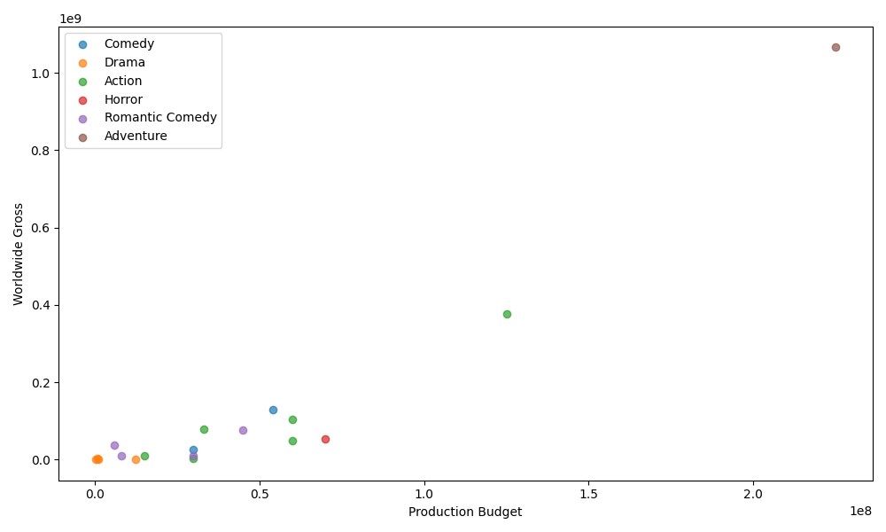
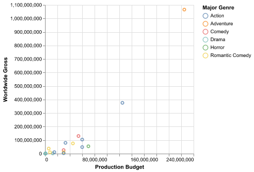
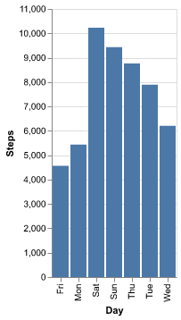
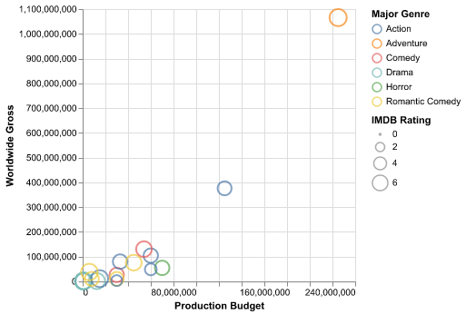
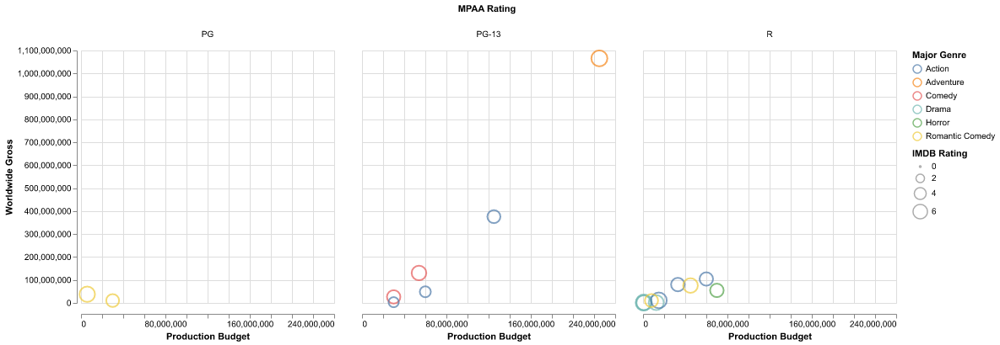
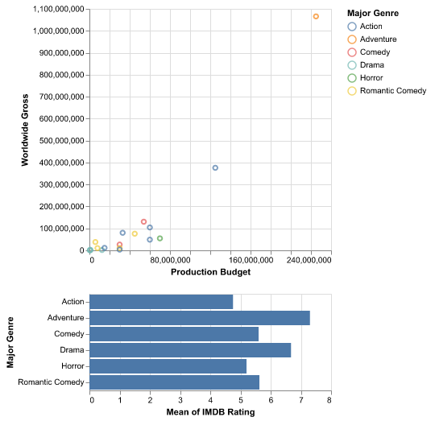

#+TITLE: 从画图理解声明式编程：Altair 的三块积木
#+AUTHOR: lujun9972,Claude Code
#+TAGS: 声明式编程,数据可视化,编程范式,API设计
#+DATE: [2026-05-03 Sun]
#+LANGUAGE: zh-CN
#+OPTIONS: H:6 num:nil toc:t \n:nil ::t |:t ^:nil -:nil f:t *:t <:nil

* 引子：两个画图程序员的对话

假设你要画一张散点图：横轴是电影制作预算，纵轴是全球票房，每个点按类型着色。

以下是 18 部电影的数据，保存为 ~/tmp/movies.csv~ 。在 Org-mode 中按 ~C-c C-v t~ 生成文件，或直接复制数据手动创建：

#+begin_src csv :tangle /tmp/movies.csv
Title,Production Budget,Worldwide Gross,Major Genre,IMDB Rating,MPAA Rating
The Whole Ten Yards,30000000.0,26323969.0,Comedy,5.1,PG-13
Dream With The Fishes,1000000.0,542909.0,Drama,6.6,R
Godzilla,125000000.0,376000000.0,Action,4.8,PG-13
Exit Wounds,33000000.0,79958599.0,Action,5.2,R
Doom,70000000.0,54612337.0,Horror,5.2,R
The Avengers,60000000.0,48585416.0,Action,3.4,PG-13
First Daughter,30000000.0,10419084.0,Romantic Comedy,4.7,PG
Raising Victor Vargas,800000.0,2811439.0,Drama,7.1,R
Tin Cup,45000000.0,75854588.0,Romantic Comedy,6.1,R
Pirates of the Caribbean: Dead Man's Chest,225000000.0,1065659812.0,Adventure,7.3,PG-13
Fighting Tommy Riley,300000.0,10514.0,Drama,6.6,R
The Funeral,12500000.0,1412799.0,Drama,6.4,R
Under Siege 2: Dark Territory,60000000.0,104324083.0,Action,5.1,R
Banlieue 13,15000000.0,11208291.0,Action,7.1,R
"You, Me and Dupree",54000000.0,130402010.0,Comedy,6.1,PG-13
Supercross,30000000.0,3252550.0,Action,2.9,PG-13
Emma,5900000.0,37831658.0,Romantic Comedy,6.8,PG
Woman on Top,8000000.0,10192613.0,Romantic Comedy,4.9,R
#+end_src

用 Matplotlib 写：

#+begin_src python :python /home/lujun9972/github/lujun9972.github.com/.venv/bin/python :results output file
import matplotlib
matplotlib.use('Agg')
import matplotlib.pyplot as plt
import pandas as pd

movies = pd.read_csv("/tmp/movies.csv")
fig, ax = plt.subplots(figsize=(10, 6))
for genre in movies["Major Genre"].unique():
    subset = movies[movies["Major Genre"] == genre]
    ax.scatter(subset["Production Budget"], subset["Worldwide Gross"],
               label=genre, alpha=0.7)
ax.set_xlabel("Production Budget")
ax.set_ylabel("Worldwide Gross")
ax.legend()
plt.tight_layout()
plt.savefig("images/matplotlib-scatter.png")
plt.close()
print("images/matplotlib-scatter.png", end="")
#+end_src

#+RESULTS:

用 Altair 写：

#+begin_src python :python /home/lujun9972/github/lujun9972.github.com/.venv/bin/python :results output file
import altair as alt
import pandas as pd

movies = pd.read_csv("/tmp/movies.csv")
chart = alt.Chart(movies).mark_point().encode(
    x="Production Budget:Q",
    y="Worldwide Gross:Q",
    color="Major Genre:N"
)
chart.save("images/altair-basic.png")
print("images/altair-basic.png", end="")
#+end_src

#+RESULTS:

两段代码做了同一件事，但思维方式完全不同。Matplotlib 是命令式的：你一步步告诉它 "创建画布 → 添加坐标轴 → 遍历数据 → 画点 → 设标签 → 加图例 → 调整布局"。代码是你的操作清单。Altair 是声明式的：你告诉它 "数据在这里，横轴是制作预算，纵轴是票房，按类型着色"。剩下的事情：坐标轴范围、刻度位置、图例排列、颜色映射：Altair 自己决定。

这两种范式差异的实质是 /描述意图（what）vs 控制过程（how）/ ，不是 "哪个库更方便" 的技术选型问题。

* Altair 的三块积木：Data→Mark→Encode

Altair 的每个图表都遵循同一个模式，由三个部分组成：

#+begin_src python
alt.Chart(数据).mark_形状().encode(列 → 视觉属性的映射)
#+end_src

用更直观的说法：

- *Data* ：你的数据 ： 一个 pandas DataFrame
- *Mark* ：你想要的视觉形状 ： 柱状条（mark_bar）、点（mark_point）、线（mark_line）、弧（mark_arc）
- *Encode* ：数据列到视觉属性的映射 ： 哪列放 X 轴、哪列染色、哪列控制点的大小

拿一周每日步数数据试一下：

#+begin_src python :python /home/lujun9972/github/lujun9972.github.com/.venv/bin/python :results output file
import altair as alt
import pandas as pd

steps = pd.DataFrame({
    "Day": ["Mon", "Tue", "Wed", "Thu", "Fri", "Sat", "Sun"],
    "Steps": [5432, 7890, 6210, 8765, 4567, 10234, 9430]
})

weekly_steps = alt.Chart(steps).mark_bar().encode(
    x="Day:O",
    y="Steps:Q"
)
weekly_steps.save("images/altair-weekly.png")
print("images/altair-weekly.png", end="")
#+end_src

#+RESULTS:

这段代码在 Jupyter Notebook 中会生成一张柱状图，X 轴是星期，Y 轴是步数。 

这种声明式写法的核心特点就是：每行代码都在描述数据的一个维度，而不是在操作图表的一个部件。

* COMMENT 声明式为什么强大

声明式的好处是 /增量成本极低/ 。

*加一个维度就是加一行编码通道*

前面那张散点图，只要在 ~.encode()~ 里加一行，就能把评分也映射上去：

#+begin_src python :python /home/lujun9972/github/lujun9972.github.com/.venv/bin/python :results output file
import altair as alt
import pandas as pd

movies = pd.read_csv("/tmp/movies.csv")
chart = alt.Chart(movies).mark_point().encode(
    x="Production Budget:Q",
    y="Worldwide Gross:Q",
    color="Major Genre:N",
    size="IMDB Rating:Q"
)
chart.save("images/altair-size.png")
print("images/altair-size.png", end="")
#+end_src

#+RESULTS:

每个点现在按类型着色、按评分大小。Altair 自动生成图例和比例尺，不需要手工设置。

*分面（Faceting）也是加一个参数的事*

#+begin_example
  分面（也叫"小多组图" small multiples）是按分类变量的不同值把数据拆成多个并排子图的技术。每个子图只展示一个类别的数据，坐标轴对齐、图例共享，方便跨类别对比。在 Altair 里，分面只是 ~.encode()~ 里的又一个参数。
#+end_example

把上面那张图按 MPAA 分级拆成并排子图，只需要加一个 ~column~ 参数：

#+begin_src python :python /home/lujun9972/github/lujun9972.github.com/.venv/bin/python :results output file
import altair as alt
import pandas as pd

movies = pd.read_csv("/tmp/movies.csv")
chart = alt.Chart(movies).mark_point().encode(
    x="Production Budget:Q",
    y="Worldwide Gross:Q",
    color="Major Genre:N",
    size="IMDB Rating:Q",
    column="MPAA Rating:O"
)
chart.save("images/altair-faceted.png")
print("images/altair-faceted.png", end="")
#+end_src

#+RESULTS:

子图的坐标轴自动同步，图例自动共享。在 Matplotlib 里做到同样的效果，需要 ~plt.subplots()~ 、手动同步坐标轴范围、单独处理图例：至少多写十几行样板代码。

声明式的逻辑是： /你描述数据的结构，工具推断出展示方式/ 。加一个 ~column="MPAA Rating:O"~ ，Altair 立刻明白 "按这个字段的不同值分开展示"。

*交互式联动也不是 "另一个问题"*

在 Altair 里，交互是图表语法的一部分，不是额外功能：

#+begin_src python :python /home/lujun9972/github/lujun9972.github.com/.venv/bin/python :results output file
import altair as alt
import pandas as pd

movies = pd.read_csv("/tmp/movies.csv")

brush = alt.selection_interval()

scatter = alt.Chart(movies).mark_point().encode(
    x="Production Budget:Q",
    y="Worldwide Gross:Q",
    color=alt.condition(brush, "Major Genre:N", alt.value("lightgray"))
).add_params(brush)

bar = alt.Chart(movies).mark_bar().encode(
    x="mean(IMDB Rating):Q",
    y="Major Genre:N"
).transform_filter(brush)

(scatter & bar).save("images/altair-interactive.png")
print("images/altair-interactive.png", end="")
#+end_src

#+RESULTS:

这段代码做了一件事：拖拽散点图上的区域，下面的柱状图自动显示选中电影的平均评分。

整个交互逻辑大约 15 行。没有 JavaScript、没有回调、没有事件绑定。

声明式的思维方式在这里体现得最彻底：你把选择定义为一个参数（ ~selection_interval()~ ），在编码通道里引用它（ ~condition(brush, ...)~ ），把联动定义为另一个图表的过滤器（ ~transform_filter(brush)~ ）。每行都在描述 "是什么"，不是在写 "怎么实现"。

* 你其实早就用过声明式

Altair 的 Data→Mark→Encode 不是独创。声明式编程你可能每天都在用，只是没意识到它属于同一个范式。

*SQL：声明式语言的代表*

#+begin_src sql
SELECT department, AVG(salary)
FROM employees
WHERE years_of_experience > 3
GROUP BY department
HAVING AVG(salary) > 50000
#+end_src

你描述你要什么：各部门中工龄 3 年以上员工的平均薪资，只显示平均薪资超过 5 万的部门。数据库自己决定用哪个索引、什么连接顺序、怎么并行执行。

SQL 和 Altair 共享同一个核心哲学： /你描述结果，系统选择路径/ 。

*正则表达式：用模式匹配替代过程*

~^\d{3}-\d{2}-\d{4}$~ 就是一个声明："我要一个 XXX-XX-XXXX 格式的字符串"。你不需要写循环逐字符检查，正则引擎帮你做。

*Clojure 的 core.logic*

函数式语言中的逻辑编程库更是直接把 "声明约束条件" 作为核心范式：

#+begin_src clojure
(run* [q]
  (membero q [1 2 3])
  (membero q [2 3 4]))
;; => (2 3)
#+end_src

你不是在写 "遍历第一个列表，对每个元素检查是否在第二个列表中"。你只是在声明约束条件："q 要在第一个列表中，也要在第二个列表中"。然后 core.logic 自己找出所有满足条件的 q。

这些例子的共同模式是： /你描述问题，而不是实现方案/ 。

* 什么时候不该用声明式

声明式不是银弹。Altair 和声明式编程都有适用范围：

*像素级定制*

当你要精确控制每个元素的颜色值、字体大小、位置偏移时，声明式的 "自动推断" 就成了障碍。Altair 允许覆盖默认值，但语法会更啰嗦，而且失去声明式的简洁感。这种场景 Matplotlib 仍是更好的选择。

*3D 可视化*

Altair 严格 2D。需要 3D 图得回 Matplotlib 或 Plotly。声明式通常不擅长处理 "非常规" 的视觉映射。

*大数据集*

Altair 把数据嵌入图表规范为 JSON，超过 5000 行会触发 ~MaxRowsError~ 。解决方案有 VegaFusion（服务端聚合）或通过 URL 传递数据，但相比 Matplotlib 的直接渲染，额外步骤不少。

这就像用 SQL 做复杂的数据清洗：虽然也能做，但用 Python 写个循环可能更直接。声明式在你需要 "标准做法的 80%" 时最高效，剩下 20% 的非常规需求可能反而更费力。

* 总结

Altair 用一个简单的模式（Data→Mark→Encode）展示了声明式编程在数据可视化中的力量。它的每个例子都遵循一个原则： /描述数据，而不是操作图表/ 。

这个原则你早就见过：SQL 声明你要什么数据而不说怎么查，正则描述文本模式而不写逐字符匹配的循环，Clojure core.logic 声明约束条件而不写遍历逻辑。

声明式的价值不是省几行代码，而是让代码表达意图而非实现细节。当你能用一句 ~color="Major Genre:N"~ 而不是一个 for 循环加 ~ax.scatter()~ 来做同一件事时，你就能腾出精力去想真正重要的问题：数据在说什么。
